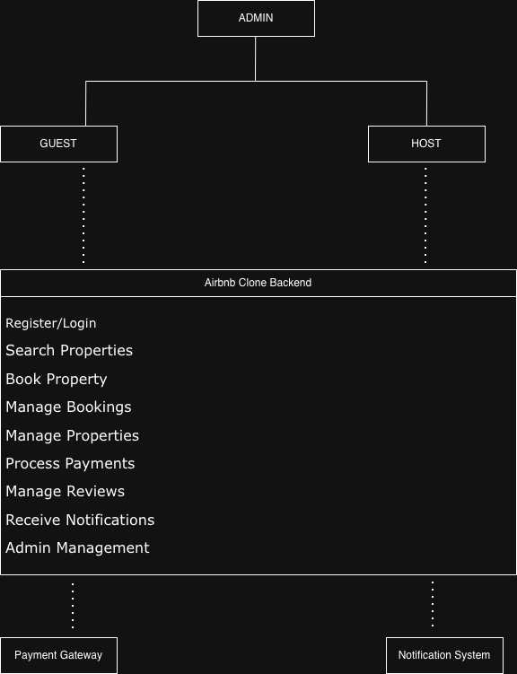

# Airbnb Clone Backend - Features and Functionalities

This document outlines the backend modules of the Airbnb Clone project and their interconnections.

## System Overview
The backend consists of multiple interconnected modules that handle the core operations of the system, as shown in the Draw.io diagram below:

## Modules Overview

| Module | Description | Key Features |
|---------|--------------|---------------|
| **User Management** | Handles registration, login, and profile updates. | JWT auth, role management, profile edit |
| **Property Management** | Manages property listings and availability. | Add/edit/delete properties |
| **Booking System** | Handles property reservations. | Create/cancel bookings, date validation |
| **Payment System** | Manages transaction processing. | Payment tracking, refunds |
| **Reviews & Ratings** | Collects user feedback on stays. | Add/view reviews, ratings |
| **Notifications** | Sends email/SMS/in-app alerts. | Booking/payment updates |
| **Security** | Ensures data protection and access control. | Encryption, input validation |
| **Admin Dashboard** | Central management for all entities. | Monitor users, properties, bookings, payments |

---

## Relationships Summary
- Users can own properties.
- Properties can have multiple bookings.
- Bookings generate payments.
- Reviews are tied to bookings.
- Admin oversees all modules.
